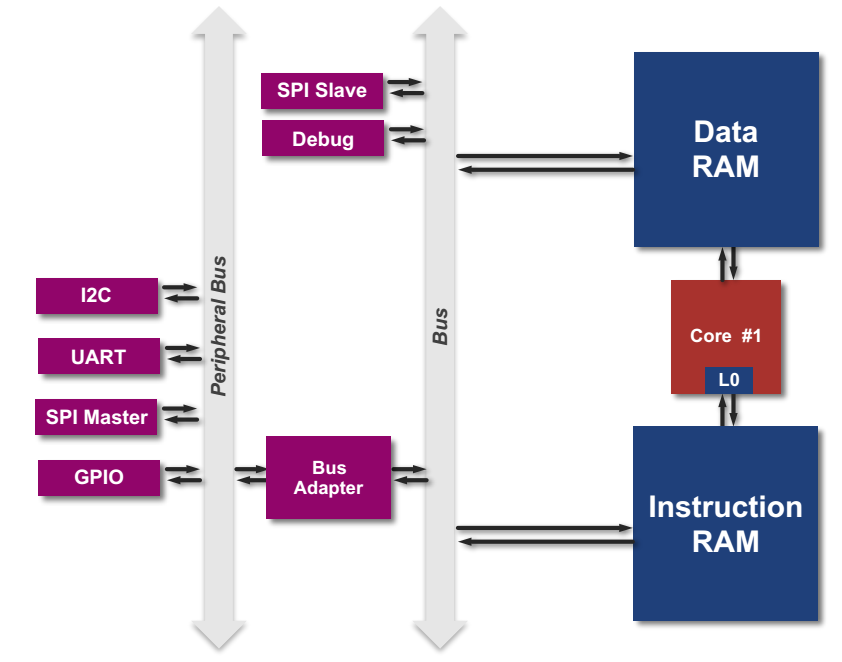
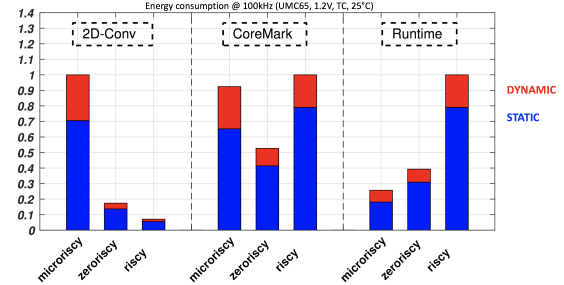
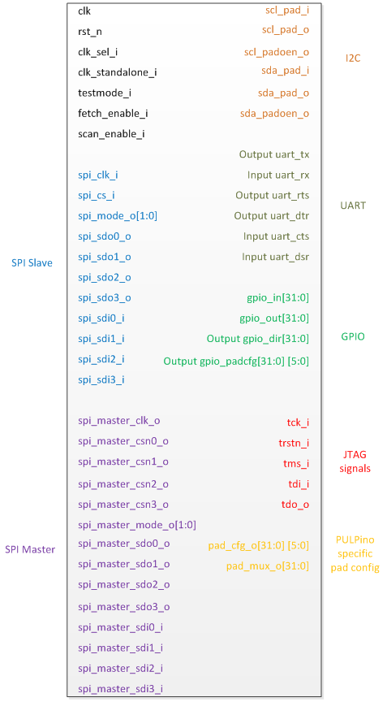
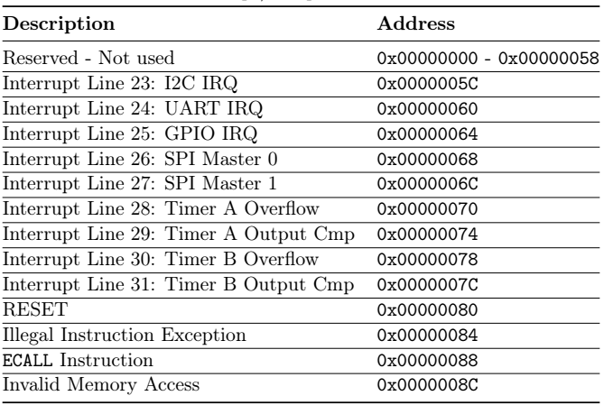

# 第八章 PULPino

## 8.1 PULP介绍
### 8.1.1 项目背景
PULP（Parallel Ultra-Low Power）项目由瑞士苏黎世联邦理工大学（ETH Zürich）的综合系统实验室（IIS：Integrated Systems laboratory）和意大利博洛尼亚大学（University of Bologna）的高能效嵌入式研究组（EEES：Energy-efficient Embedded Systems）联合设计研发，目的是实现一个开放、可扩展的SoC，并且总体功耗在mW级，能效达到pJ/op[1]。 
 
该项目的现实意义在于满足IoT（Internet of Thing）设备对计算能力的需求，当前，IoT设备的数量与日俱增，具有的功能也越来越多，可以获取周边的图像、环境参数等大量数据，进行如人脸识别等应用，但是这需要大量的计算能力，当前的IoT设备无法满足该需求，只能将数据通过无线的模式发送到计算平台进行集中计算，但是通信又需要消耗大量的能量，对于靠电池供电的IoT设备而言，这样做无疑降低了其使用寿命。为了解决上述问题，出现了特定应用加速器，应用在IoT设备上作为扩展，既降低了功耗，又实现了高的计算能力，但是这种方式的缺点就是缺乏灵活性，特定应用加速器是某一种特定运算的ASIC，功能有限，PULP弥补了这条鸿沟，其通过架构的优化设计，实现了既拥有强大的计算能力，又满足IoT设备低功耗需求，同时还具有通用处理器的灵活性。
### 8.1.2 架构介绍
其架构设计如图8-1所示。 
 
 
图8-1 PULP架构设计[2]  
从图8-1的右半边可以发现PULP是一个多核SoC，其处理器核目前有两种，一种是采用OpenRISC指令集的OR10N，另一种是采用RISC-V指令集的RI5CY。除了多核设计，为了实现低功耗、高性能的目的，PULP还采用了如下一些优化设计：  
（1）指令集扩展：PULP扩展了原有的指令集，使得其支持以下特性（详细内容会在本章后续部分依次介绍）。 
* 算术指令扩展（ALU Extension）
* 硬件循环（Hardware Loop）
* 地址自增的访存指令（post-incrementing Load & Strore Instruciton）
* 乘累加指令（Multiply-Accumulate）
* 向量操作（Vectorial）
（2）共享指令缓存：多个处理器核共享一个L1指令缓存，避免了为了维护缓存一致性带来的复杂性，而且采用的是SCM（Standard Cell based Memories），可以在更低的电压下工作，从而进一步降低了功耗。 
 
（3）指令预取Buffer：共享的指令缓存可能会由于多个处理器核同时访问，而增加延迟，为此，为每个处理器设计了一个指令预取Buffer，该Buffer的大小一般是指令缓存line的大小，比如128bit。同时，对于RISC-V指令集而言，该指令预取Buffer还实现了16bit压缩指令扩展为32bit。  
（4）紧耦合数据缓存：使用的是Scratchpad Memroy，分为多个bank，一般为8KB，每个bank还对应一个SCM，一般为1KB。  
经过上述优化，可以大幅提高能效，在28nm工艺下，工作电压可以低至0.46V，功耗1mW，此时仍然有比较好的性能表现，主频40MHz，0.2GOPS[3]。
### 8.1.3 流片情况
PULP在研发过程中，已多次流片，如表8-1所示。  
表8-1 PULP流片情况 
<table>
<tr>
	<td>名称</td>
	<td>工艺</td>
	<td>工艺</td>
	<td>主频</td>
	<td>时间</td>
	<td>备注</td>	
</tr>
<tr>
	<td>Manny</td>
	<td>180nm</td>
	<td>3 W @0.6V 1.5MHz</td>
	<td>1.25 MHz</td>
	<td>2015年</td>
	<td>四核, 64 kB二级缓存16KB紧耦合数据缓存，4KB指令缓存</td>	
</tr>
<tr>
	<td>Diego</td>
	<td>180nm</td>
	<td>3 W @0.8V 15 MHz</td>
	<td>15 MHz</td>
	<td>2015年</td>
	<td>同上</td>	
</tr>
<tr>
	<td>Sid</td>
	<td>180nm</td>
	<td>3 W @1.0V 15 MHz</td>
	<td>15 MHz</td>
	<td>2015年</td>
	<td>同上</td>	
</tr>
<tr>
	<td>Vivosoc</td>
	<td>130nm</td>
	<td>45 mW @1.2V 40MHz</td>
	<td>140 MHz</td>
	<td>2015年</td>
	<td>用于生物医学信号采集，可穿戴设备上，双核</td>	
</tr>
<tr>
	<td>Vivosoc2</td>
	<td>130nm</td>
	<td>20 mW @1.2V 50MHz</td>
	<td>64 MHz</td>
	<td>2016年</td>
	<td>同上，但是是四核</td>	
</tr>
<tr>
	<td>Vivosoc2.001</td>
	<td>130nm</td>
	<td>20 mW @1.2V 50MHz</td>
	<td>64 MHz</td>
	<td>2016年</td>
	<td>同上，但是是四核</td>	
</tr>
<tr>
	<td>Mia_Wallace</td>
	<td>65nm</td>
	<td>1 mW @1.2V 1MHz</td>
	<td>400 MHz</td>
	<td>2015年</td>
	<td>四核，其中有一个卷积码加速器</td>	
</tr>
<tr>
	<td>Fulmine</td>
	<td>65nm</td>
	<td>13 mW @ 0.8 V, 104 MHz</td>
	<td>400 MHz</td>
	<td>2015年</td>
	<td>Mia_Wallace的改进型，增加了一个密码加速器</td>	
</tr>
<tr>
	<td>Artemis</td>
	<td>65nm</td>
	<td>1 mW @1.2V 1MHz</td>
	<td>500 MHz</td>
	<td>2014年</td>
	<td>四核，每个处理器核增加了一个FPU</td>	
</tr>
<tr>
	<td>Hecate</td>
	<td>65nm</td>
	<td>1 mW @1.2V 1MHz</td>
	<td>500 MHz</td>
	<td>2014年</td>
	<td>四核，共享两个FPU</td>	
</tr>
<tr>
	<td>Diana</td>
	<td>65nm</td>
	<td>1 mW @1.2V 1MHz</td>
	<td>500 MHz</td>
	<td>2014年</td>
	<td>四核，1个标准FPU，3个裁剪的FPU</td>	
</tr>
<tr>
	<td>Phoebe</td>
	<td>65nm</td>
	<td>22 mW @1.2V 100MHz</td>
	<td>500 MHz</td>
	<td>2015年</td>
	<td>Selene的改进版</td>	
</tr>
<tr>
	<td>Pulp</td>
	<td>28nm</td>
	<td>8 mW @0.7V 10MHz</td>
	<td>475 MHz</td>
	<td>2013年</td>
	<td>四核</td>	
</tr>
<tr>
	<td>Pulpv2</td>
	<td>28nm</td>
	<td></td>
	<td>1000 MHz</td>
	<td>2014年</td>
	<td>四核</td>	
</tr>
<tr>
	<td>Pulpv3</td>
	<td>28nm</td>
	<td>1.2 mW @ 0.6V, 50MHz</td>
	<td>66 MHz</td>
	<td>2015年</td>
	<td>同上，集成了一个卷积运算加速器</td>	
</tr>
<tr>
	<td>Honey_Bunny</td>
	<td>28nm</td>
	<td>1 mW @1.2V 1MHz</td>
	<td>60 MHz</td>
	<td>2015年</td>
	<td>第一个使用RI5CY作为处理器核的PULP</td>	
</tr>
</table>

## 8.2 PULPino介绍
### 8.2.1 PULPino与PULP的关系
PULPino是PULP的简化版本，如图8-2所示。 
 
图8-2 PULPino架构是PULP架构的简化版[2]  
对比图8-1PULP架构设计可知PULPino相比PULP在如下几个方面做了简化： 
（1）多核变为单核； 
（2）指令RAM、数据RAM都不再需要支持多核； 
（3）去掉了二级缓存； 
（4）去掉了DMA。 
此外还有一个变化：源代码于2016年3月1日开源，采用 Solderpad license，使用的编程语言是System Verilog，PULPino支持处理器核是采用OpenRISC指令集的OR10N，但是在目前的开源版本中只支持RISC-V指令集。 

### 8.2.2 PULPino的结构
相较图8-2而言，图8-3更加具体、完整的显示了PULPino的结构。 
 
图8-3 PULPino的结构[4]  
从图中可以发现PULPino有如下一些特点： 
（1）采用的是指令RAM、数据RAM分开的哈佛结构； 
（2）增加了一个Boot ROM，其中可以存储启动代码，利用该启动代码可以加载连接至SPI接口的Flash中的程序。 
（3）采用的AXI4、APB两级总线结构。 
（4）具有外设接口，包括GPIO、UART、I2C、SPI等。 
（5）含有一个SoC Controll模块，其作用是整个SoC平台的控制信息，包括：是否使能时钟门、设置启动地址、架构信息等。 
（6）提供了一个Advanced Debug Unit，提供了标准调试JTAG接口，使得调试器可以访问指令RAM、数据RAM、处理器内部寄存器，以及外设对应的控制寄存器等。 
（7）提供了一个SPI Slave接口，直接连接在AXI互连总线上，可以通过该接口在不影响处理器的情况下，访问指令RAM、数据RAM、处理器内部寄存器，以及外设对应的控制寄存器等。 
图8-2中各模块的详细功能、寄存器作用可以参考文献[4]。 

### 8.2.3 处理器核
PULPino目前支持4种不同配置的、采用RISC-V指令集的处理器核，如下： 
（1）RI5CY：这是最早开源的处理器核，支持RV32-ICM，并且支持算术指令扩展（ALU Extension）、硬件循环（Hardware Loop）、地址自增的访存指令（post-incrementing Load & Strore Instruciton）、乘累加指令（Multiply-Accumulate）、向量操作（Vectorial）等扩展。 
（2）RI5CY+FPU：包括RI5CY，以及一个符合IEEE-754标准的单精度FPU。 
（3）Zero-riscy：支持RV32-ICM，在占用资源上做了优化。 
（4）Micro-riscy: 这是4种配置中占用资源最少的，支持RV32-EC，具有16个寄存器，且不支持硬件乘法。 
不同配置的资源占用情况如图8-4所示。Micro-riscy的资源占用是RI5CY的接近1/4。  
 
图8-4 不同配置的资源占用情况[5]  
图8-5是不同配置在不同应用环境中的能耗情况。从图中可以发现，不同的配置适合于不同的应用场景，如果用于数字信号处理领域，有比较多的卷积运算，那么RI5CY的能耗是最低的，因为它做了指令扩展，内部有专用硬件用于实现卷积运算。如果用于控制领域，那么Micro-riscy的能耗最低。所以，用户需要依据不同的应用场景，配置PULPino。  
 
图8-5 不同配置在不同应用环境中的能耗情况[5] 

### 8.2.4 接口描述
开发者可以在https://github.com/pulp-platform/pulpino 下载得到PULPino的源代码，其中rtl目录下的pulpino_top.sv是PULPino的顶层文件，通过该文件可以得到PULPino的接口示意图如图8-6所示。对于大多数接口都可以通过接口名称最后的_i还是_o区分出是输入接口还是输出接口。  
 
图8-6 PULPino接口示意图  
按照功能可以分为几类：全局信号接口、SPI Slave、SPI Master、I2C、UART、GPIO、JTAG、pad config等，与图8-3基本一致。其中全局接口的描述如表8-2所示。  
表8-2 PULPino的全局接口 
<table>
<tr>
	<td>信号名</td>
	<td>作用</td>
</tr>
<tr>
	<td>clk</td>
	<td>时钟信号</td>
</tr>
<tr>
	<td>rst_n</td>
	<td>复位信号</td>
</tr>
<tr>
	<td>clk_sel_i</td>
	<td>用来选择工作时钟，如果是0，那么时钟就是clk，反之，时钟来自一个锁频环，用于ASIC生产时，clk_sel_i设置为1</td>
</tr>
<tr>
	<td>clk_standalone_i</td>
	<td>与锁频环相关的控制信号</td>
</tr>
<tr>
	<td>testmode_i</td>
	<td>如果为1，那么禁止clock gate，反之，使能clock gate</td>
</tr>
<tr>
	<td>fetch_enable_i</td>
	<td>如果为1，表示开始取指译码执行</td>
</tr>
<tr>
	<td>scan_enable_i</td>
	<td>与锁频环相关的控制信号</td>
</tr>
</table>

### 8.2.5 地址空间分配
PULPino默认的指令RAM、数据RAM的大小都是32KB，在rtl目录下的core_region.sv的最开始有如下定义，可以依据需求修改指令RAM、数据RAM的大小。 
~~~verilog
module core_region
#(
    parameter AXI_ADDR_WIDTH       = 32,
    parameter AXI_DATA_WIDTH       = 64,
    parameter AXI_ID_MASTER_WIDTH  = 10,
    parameter AXI_ID_SLAVE_WIDTH   = 10,
    parameter AXI_USER_WIDTH       = 0,
    parameter DATA_RAM_SIZE        = 32768, // in bytes
    parameter INSTR_RAM_SIZE       = 32768  // in bytes
  )
~~~
   
默认的地址空间分配如图8-7所示。该图与参考文献[4]的图2.1有差别，主要是Boot ROM的起始地址不同，此处是依据实际代码确定Boot ROM起始地址是0x0000_8000，参考文献[4]的图2.1中Boot ROM起始地址是0x0008_0000。 
 
图8-7 默认的地址空间分配  
整体上可以分为四个区域：指令RAM、Boot ROM、数据RAM、外设。这个地址空间分配方案是在rtl目录下的top.sv中定义的，如下，可以通过修改其中的代码，实现地址空间分配方案的重新定义。 
~~~verilog
module core_region
#(
    parameter AXI_ADDR_WIDTH       = 32,
    parameter AXI_DATA_WIDTH       = 64,
    parameter AXI_ID_MASTER_WIDTH  = 10,
    parameter AXI_ID_SLAVE_WIDTH   = 10,
    parameter AXI_USER_WIDTH       = 0,
    parameter DATA_RAM_SIZE        = 32768, // in bytes
    parameter INSTR_RAM_SIZE       = 32768  // in bytes
  )
~~~ 
  
上述代码定义了AXI总线上三个设备的地址，如下：
* 设备1：起始地址是32'h1A10_0000，终止地址是32'h1A11_FFFF
* 设备2：起始地址是32'h0010_0000，终止地址是32'h001F_FFFF
* 设备3：起始地址是32'h0000_0000，终止地址是32'h000F_FFFF
结合图8-3、图8-7可以非常直观的发现，设备1就是图8-7中的各种外设的地址空间，也就是图8-3中的挂在APB总线下的各种外设；设备2就是图8-7中的数据RAM；设备3就是图8-7中指令RAM+Boot ROM。 
在rtl目录下的instr_ram_wrap.sv中依据指令地址，判断是从Boot ROM还是从指令RAM中取指令，如下： 
~~~verilog
module instr_ram_wrap
  #(
parameter RAM_SIZE   = 32768,                // in bytes
// one bit more than necessary, for the boot rom
    parameter ADDR_WIDTH = $clog2(RAM_SIZE) + 1, 
    parameter DATA_WIDTH = 32
  )(
  ......
// 为1表示从Boot ROM中取指，反之，从指令RAM中取指
  assign is_boot = (addr_i[ADDR_WIDTH-1] == 1'b1);
......
~~~
 
在include\apb_bus.sv中由各中外设的地址空间定义，如下： 
~~~verilog
// MASTER PORT TO CVP
`define UART_START_ADDR       32'h1A10_0000
`define UART_END_ADDR         32'h1A10_0FFF

// MASTER PORT TO GPIO
`define GPIO_START_ADDR       32'h1A10_1000
`define GPIO_END_ADDR         32'h1A10_1FFF

// MASTER PORT TO SPI MASTER
`define SPI_START_ADDR        32'h1A10_2000
`define SPI_END_ADDR          32'h1A10_2FFF

// MASTER PORT TO TIMER
`define TIMER_START_ADDR      32'h1A10_3000
`define TIMER_END_ADDR        32'h1A10_3FFF

// MASTER PORT TO EVENT UNIT
`define EVENT_UNIT_START_ADDR 32'h1A10_4000
`define EVENT_UNIT_END_ADDR   32'h1A10_4FFF

// MASTER PORT TO I2C
`define I2C_START_ADDR        32'h1A10_5000
`define I2C_END_ADDR          32'h1A10_5FFF

// MASTER PORT TO FLL
`define FLL_START_ADDR        32'h1A10_6000
`define FLL_END_ADDR          32'h1A10_6FFF

// MASTER PORT TO SOC CTRL
`define SOC_CTRL_START_ADDR   32'h1A10_7000
`define SOC_CTRL_END_ADDR     32'h1A10_7FFF

// MASTER PORT TO DEBUG
`define DEBUG_START_ADDR      32'h1A11_0000
`define DEBUG_END_ADDR        32'h1A11_7FFF
~~~
### 8.2.6 中断处理过程
PULPino采用中断向量表的方式处理中断，图8-8是默认的中断类型，及其对应的中断处理例程的入口地址，每个中断处理例程占用4个字节，可以防止一条32位的指令，或者两条16位的指令，一般是转移指令，转移到具体的中断处理函数。 
 
图8-8 中断向量表 

 
下面的目录要修改

## 8.3 向量算术指令
介绍什么是向量运算、RI5CY的向量运算指令、优势特点、实现等

## 8.4 硬件循环
介绍硬件循环的原理、优势、实现等

## 8.5 post increment load/store指令
不知道准确的翻译是什么

## 8.6 扩展算术指令

## 8.7 基于Arty平台的移植试验（leishangwen）
官网上只是在zedboard上做了测试，而且是需要ARM配合，这里计划使用Arty平台测试，与Freedom E310的测试平台是同一个，移植后，可以独立运行，不需要ARM配合。同时，在移植过程中，就顺便讲解关键脚本、boot code、测试程序等。此外，还介绍调试过程，这个也是官网没有的。

## 参考文献
[1]PULP - An Open Parallel Ultra-Low-Power Processing-Platform, http://iis-projects.ee.ethz.ch/index.php/PULP,2017-8 
[2]Florian Zaruba, Updates on PULPino, The 5th RISC-V Workshop, 2016. 
[3]Michael Gautschi,etc,Near-Threshold RISC-V Core With DSP Extensions for Scalable IoT Endpoint Devices, IEEE Transactions on Very Large Scale Integration Systems 
[4]Andreas Traber, Michael Gautschi,PULPino: Datasheet,2016.11 
[5]http://www.pulp-platform.org/ 